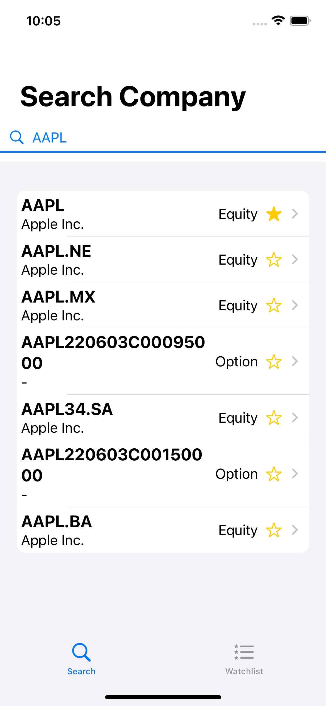
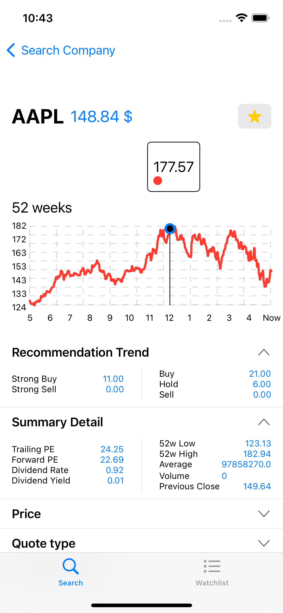
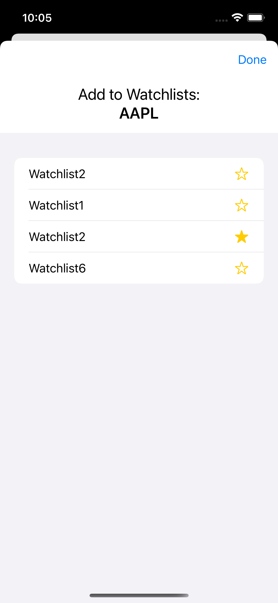
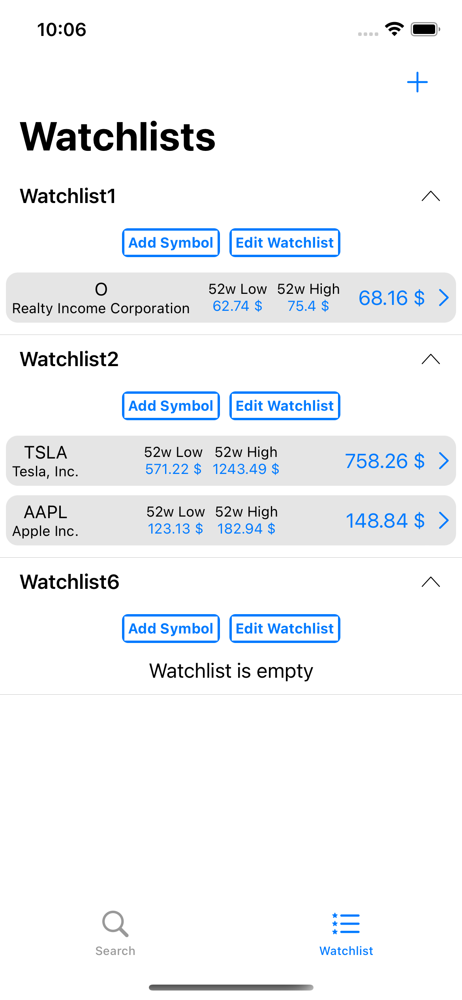
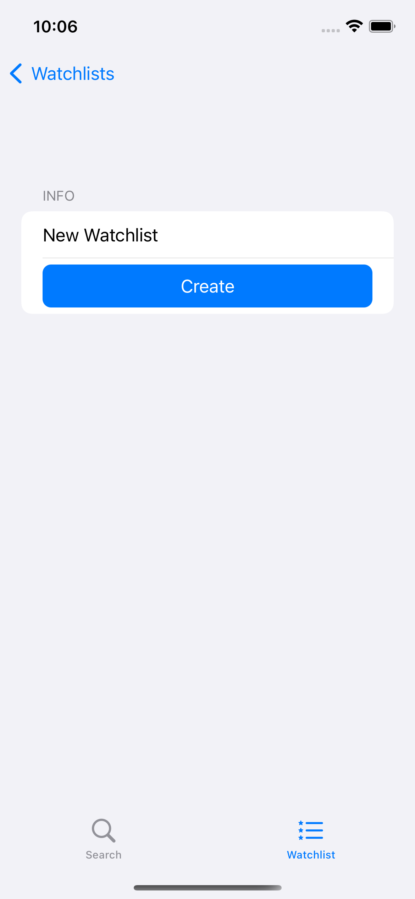
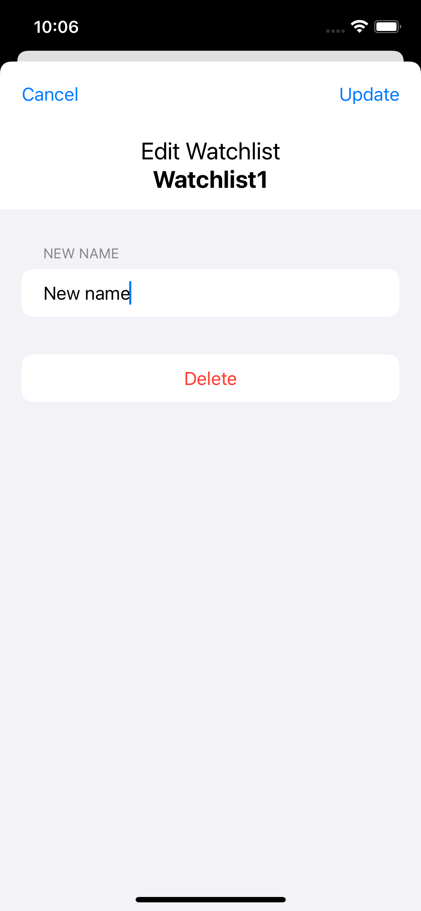

## Company Watcher

## Author: Zdeněk Lapeš (xlapes02)

---

### The application is designed for IOS

**Application goal is to made searching and tracking favourite company easier and faster.**

### Available functionalities:

- **Search Company** *(You can search any company you want based on company ***name*** or ***ticker***)*
- - **Go to company's details** *(Each searched item is NavigationLink that takes you to Company details view)*
- - **Add company to watchlist** *(Star Icon is a button (on tap you can add company into watchlist))*

    

 

- **Company details** *(Here you can see graph (for ****52 weeks price history) or information about company)*
- - **Company ticker and current price** *(Price is updated in 5 seconds interval)*
- - **Graph** *(It shows 52 weeks price history - on tap you can see price at the time)*
- - **Information about company** (Information is in expandable list (it will expand on click))*
- - **Prices**
- - - Recommendation trend
- - - Details about company history and perspective for future
- - - Quote Details
- - - Summary profile *(Includes information about company (websites, phone, employees count, etc...))*
- - **Add company to watchlist** *(Start icon in the top right corner - takes you to another view,
where you can choose into which watchlist put the Company)*

    
    

 

- **Watchlist** *(List of all watchlists and favorite companies)*
- - **List of all created watchlists** *(Each record is an expandable list)*
- - **Functionality watchlist**: *create / edit / delete*
- - **Functionality list items(companies)**: *add or remove* company from watchlists
- - **Go to company detail view** *(Each list item (company) is a NavigationLink (on tap it takes you to Company details view))*

    
    
    

